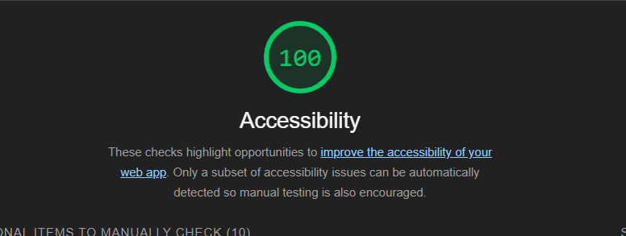

# Code201d98 LAB

## Odd Duck Products

A concept web application that helps the Odd Duck Product Co decide which project from their R&D department they should invest in next to sell.

### Author: Donna Ada

### Links and Resources

* [Odd Duck Demo Site](https://donnaada.github.io/odd-duck/)

### Lighthouse Accessibility Report Score



### Tree Structure

* The structure does not fully list out all the images in the `img` directory but gives a representation of the structure of the project.

```sh
Project Directory
├── .eslintrc.json
├── .gitignore
├── LICENSE
├── README.md
├── assets
│   ├── css
│   │   ├── reset.css
│   │   └── style.css
│   ├── img/
│   └── js
│       └── main.js
└── index.html

```
